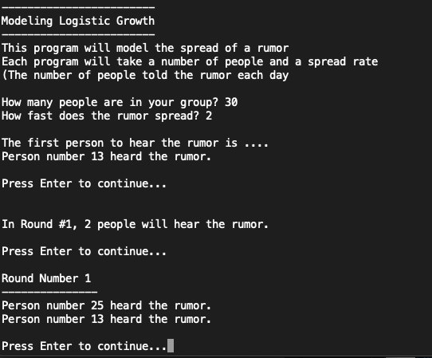
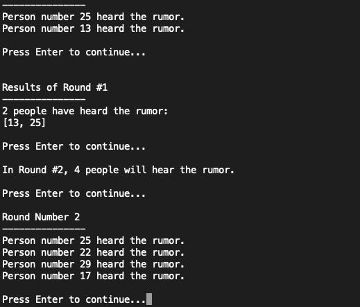
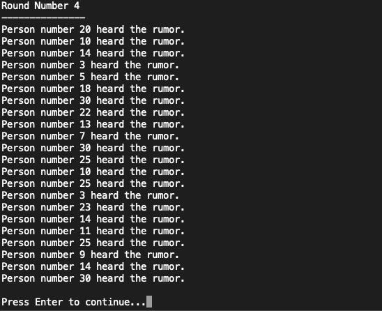
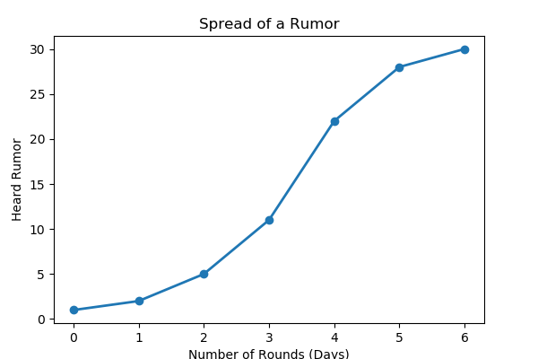

# spread-of-a-rumor

A Logistic Exponential Growth demo for AP Calculus BC

Ever wonder how you could model the spread of a rumor or a disease in a population.  This script will give simulate the spread of a rumor in a population given the size of the population and the rule for the spread of the rumor.  Each person who hears the rumor (and isn't supposed to tell anyone about it), tells the number of people according to the rule each day.  The output is a text table with the Rounds(Days) and Total number of people who have heard the rumor on that day and a graph of the results. 

### Methods
* Python
* Pandas
* Matplotlib

### Directions to Run
This program will run in Python 3.7 in your terminal.  Download the logisticmodel.py file. In your terminal navigage to the directory that contains the file and type ```python logisticmodel.py``` and it will run in your CLI.

### Preview





